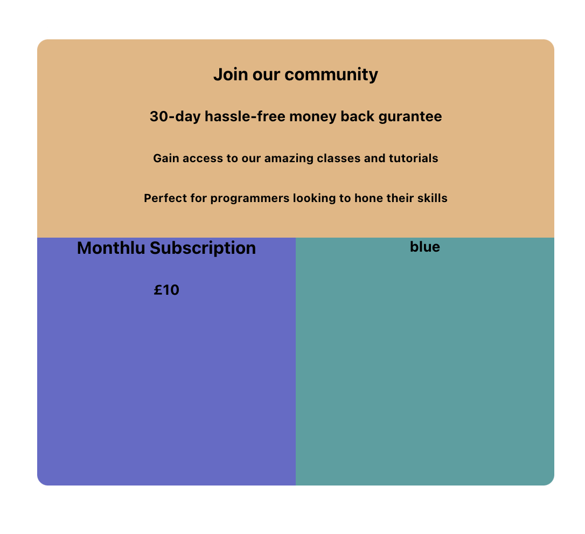
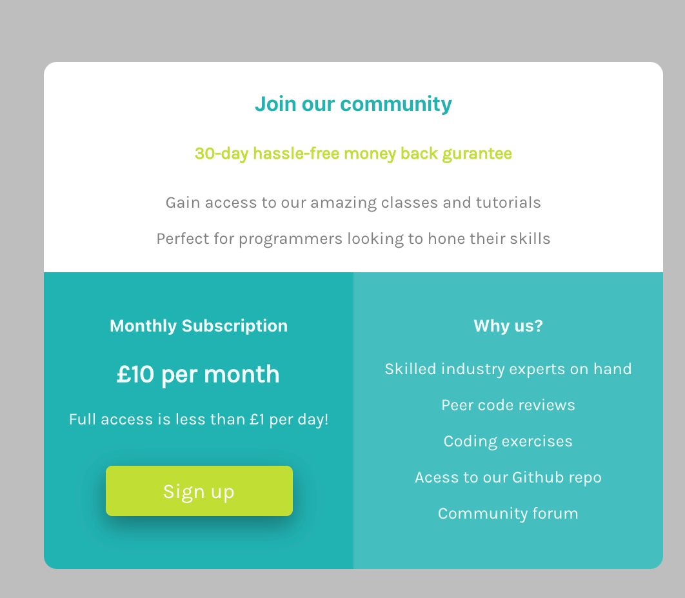
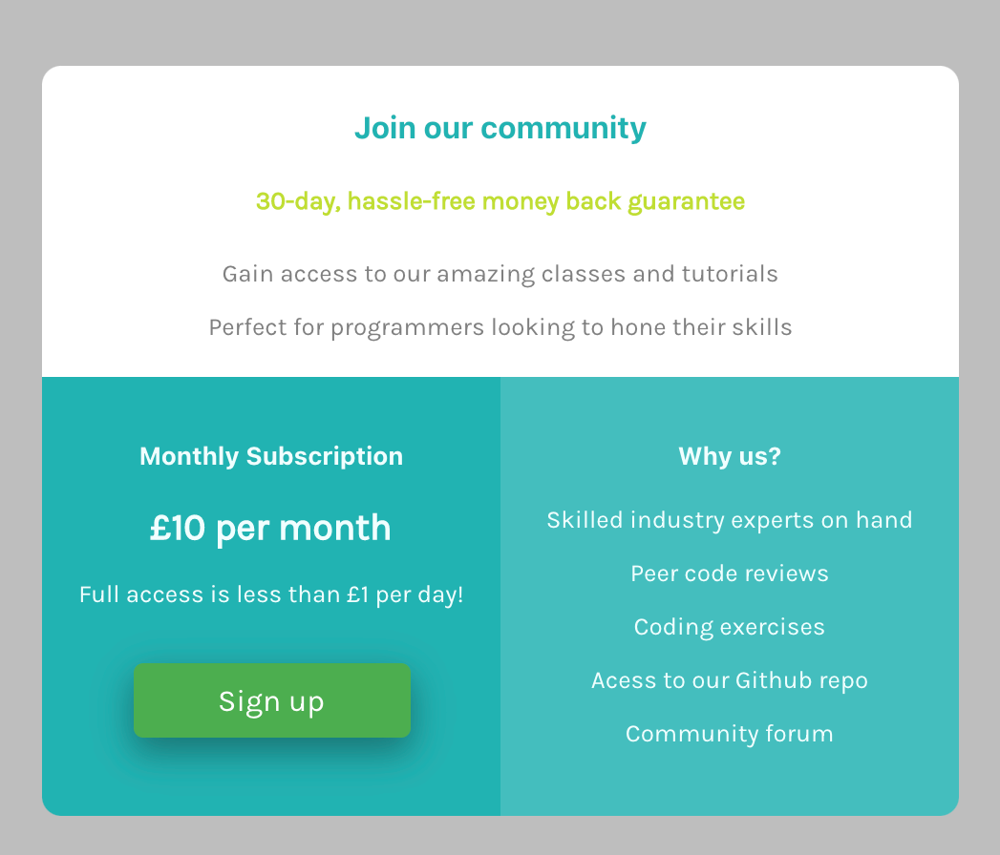

Yesterday was challenging as I had taken some time off for the Christmas break but it was still challenging to get back into physically building. No one tells you how hard it is to create ideas and build said ideas with no brief or specific requirements. Over the several days of this coding challenge I have realised it is not just about learning code but also learning how to programme your brain into the developer mindset as well as learning how to structure and build upon your idea in a logical way i.e. writing down the aim of your project/purpose to then being able to create a prototype and get an idea of how it should be built to actually building in addition to writing tests! 

It can be all very overwhelming trying to find an idea but I found an amazing article outlining different frontend projects and I have decided to work through this to reintroduce myself back into code as opposed to diving into a massive project.

[16 Frontend projects](https://dev.to/frontendmentor/16-front-end-projects-with-designs-to-help-improve-your-coding-skills-5ajl)

#### Updates:

This is how my single component is currently looking, took me an hour to just get all the positioning correct and I am now thinking there must be an easier way to get everythibg the same size and postiion. 

Sometimes pushing forward helps this looks much better

How it finally looks 

I didn't actually use flexbox as I didn't need to but this was a great challenge to refresh my coding skills.
The component is static but the sign up button has a hover element.
To improve upon this component I would create another component where the sign up button can actually lead to a form where the user could sign up.

Doing this has taught there is so much CSS can do and I have merely scratched the surface!

##### My links 
[Medium](https://medium.com/@kalemajoanna).

[LinkedIn](https://www.linkedin.com/in/joanna-e-kalema-a5a5b4136/)

[Portfolio](https://joannathedeveloper.netlify.app/)

