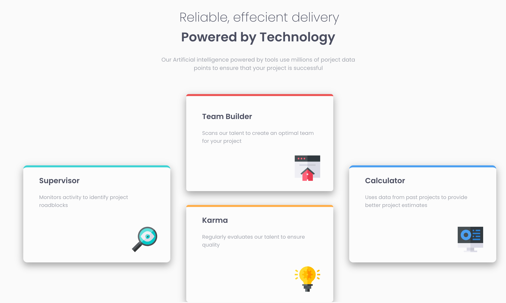

I took another few days off due to it being my birthday on the 3rd!

Yes I am still working on this project just trying to really ensure the project looks exactly like the examplar project

Check it out here [Four cards project](https://github.com/jokale/4comp)

#### Updates:

It is finally complete!!!
Sometimes you really need to just switch on and focus and get the project done.

This is how it looks finally:

It has been a long few days but its been a great learning experience and has made me realise there is always more to learn about CSS.

I utilised [w3schools](https://www.w3schools.com/css/css_positioning.asp) to learn about CSS positioning.

##### My links 
[Medium](https://medium.com/@kalemajoanna).

[LinkedIn](https://www.linkedin.com/in/joanna-e-kalema-a5a5b4136/)

[Portfolio](https://joannathedeveloper.netlify.app/)

