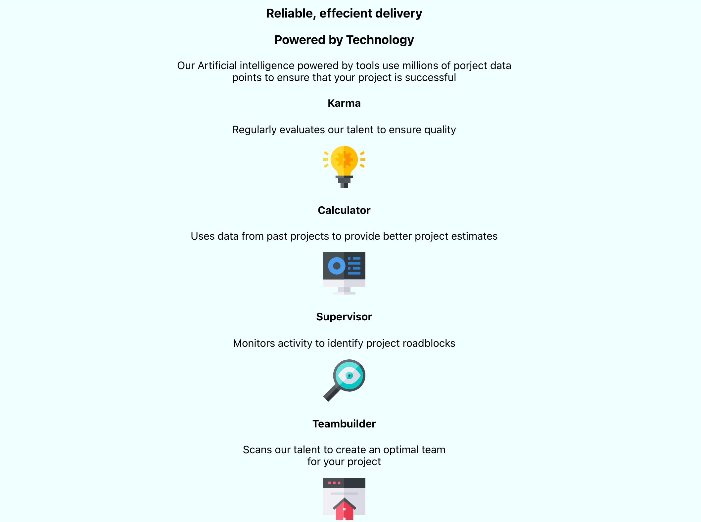

Using this [16 Frontend projects](https://dev.to/frontendmentor/16-front-end-projects-with-designs-to-help-improve-your-coding-skills-5ajl) link to help me come up with some new things to build some ideas.

Today I will be building a Four card feature section whereby users should be able to:

- View the optimal layout for the site depending on their device's screen size

Trying to get my projects to alter according to the device size is something I have been struggling with but I will continue to press on and keep learning.
I am still conviced there is a better way to align everything and I am sure its flexbox.

#### Updates:

This is how the page is currently looking with no styling

I like to get everything on the page and then start working on each component or segment of the page one by one .

##### My links 
[Medium](https://medium.com/@kalemajoanna).

[LinkedIn](https://www.linkedin.com/in/joanna-e-kalema-a5a5b4136/)

[Portfolio](https://joannathedeveloper.netlify.app/)

