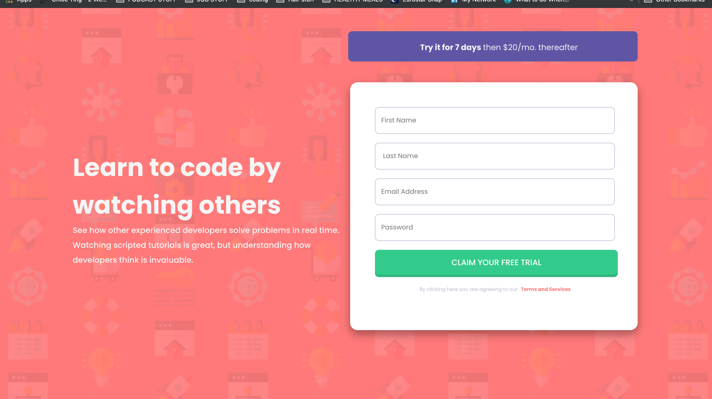

Its another week! and day 95 so 5 days until 100 days are officially up (even though I will keep coding regardless)
Today I will be working on a new project where I will be building an Intro component with a sign-up form whereby users should be able to :

- View the optimal layout for the site depending on their device's screen size
- See hover states for all interactive elements on the page
- Receive an error message when the form is submitted if:
  - Any input field is empty
  - The email address is not formatted correctly

I will also continue to work on  Javascript Algorithms and Data Structures Certification on[freecodecamp](https://www.freecodecamp.org/learn/).

It will be good to get some certification to show for what I have been learning. 
I wish I had started with the certifications first but regardless I have learnt a lot.

#### Updates:
This is currently how my project is looking like :

Still a bit rough around the edges but looking to add the finishing touches and form validation over the next few days.

##### My links 
[Medium](https://medium.com/@kalemajoanna)

[LinkedIn](https://www.linkedin.com/in/joanna-e-kalema-a5a5b4136/)

[Portfolio](https://joannathedeveloper.netlify.app/)

