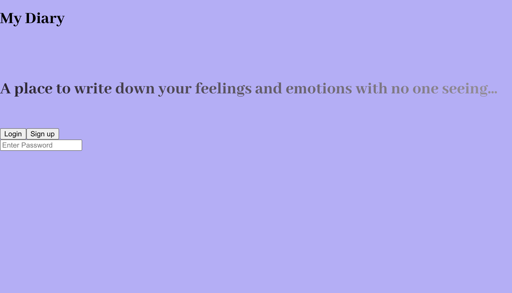

Today was a lazy coding day on my behalf and I spent the day trying to add some styling to my diary app as well as learning more about CSS and I have learnt there is so much that can be done with CSS but it also has it's drawbacks.

Building this particular project has made me realise everyone works differently but I am sure there is a better way to build things and code things too. What even is the right or wrong way?

Below is a screenshot of what my project was looking like by the last commit. 
It isn't the best looking right now as I often like to build everything I need then go back and fix each component one by one.

##### My links 
[Medium](https://medium.com/@kalemajoanna).

[LinkedIn](https://www.linkedin.com/in/joanna-e-kalema-a5a5b4136/)

[Portfolio](https://joannathedeveloper.netlify.app/)

