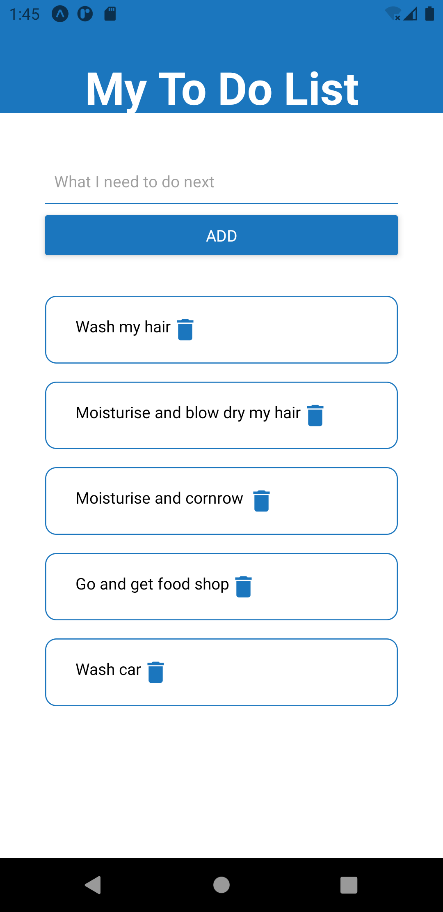

Today I will be looking over :

- Component Validation with PropTypes
- Authentication

The aim is to try and utilise everything I have been learning over the week and use it whilst building my diary app. I may create a figma prototype to get a better idea of what I want the project to look like 

#### UPDATES :

* A great link regarding validation of props with Proptypes [Validation of Proptypes](https://blog.logrocket.com/validating-react-component-props-with-prop-types-ef14b29963fc/) 
This explained why we often need to validate Props. Sometimes whilst we code away we may forget to pass down the revelant props to the necessary child component leading to malfunctioning code and bugs. Utilising propTypes allows us to check and validate the prop we are supposed to be using in a specific component. If said component has been passed the incorrect prop we get a lovely error in the console alerting us of this. As opposed to code breaking and us scrambling our brains to figure out what caused our code to break.

 #### There are severval ways to Authenticate ####
 - [Auth0](https://auth0.com/blog/complete-guide-to-react-user-authentication/)
 - [Okta](https://medium.com/better-programming/building-basic-react-authentication-e20a574d5e71)
 - [Firebase] 
 I am sure there are plenty more but here are a few I have come across in the few months and have actually used, some more successful than others.

#### What is Authentication? ####
For those who don't understand what Authentication is simply put its just a security measure for web apps, software to basically verify its you to ensure you can get access to your own data and only your own.
However if poorly done it would mean people could break web apps and software to access your data which is not good! 
That is why it is important when creating an application that utilises authentication, that the authentication you are using is working well and is not breakable!

I will start building up the prototype of my diary app to get a better idea of how it will look. Despite I want to go into Frontend Development I have found the importance of being able to build your idea without code so you can get a better idea of how you want it to look and in turn you get an idea of how the application will function!

Will attach how the prototype looks below!

##### My links 
[Medium](https://medium.com/@kalemajoanna).

[LinkedIn](https://www.linkedin.com/in/joanna-e-kalema-a5a5b4136/)

[Portfolio](https://joannathedeveloper.netlify.app/)

