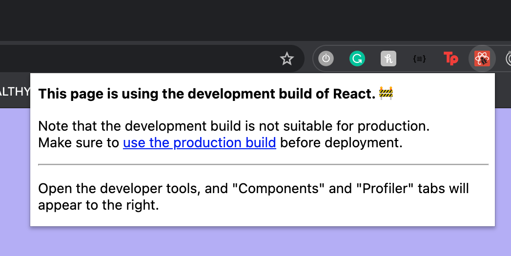
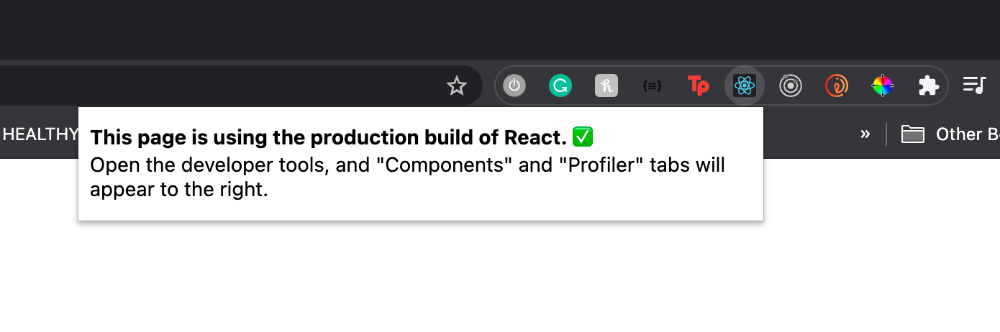

Today I will be focusing on 

- Utilising authentication
- Building React for Production
- Deploying to Now

I have never used Now so it will interesting to see how it differs from Netlify and potentially I will use it to deploy my project 

I will continue to build my project and try continue work around firebase.

#### Updates:

It seems as though without realising I have been building in React in development mode which makes sense because when you are building a project it is in the development stages! When it is deployed it is then in the production build mode.

##### what does production build actually mean?

In simple laymans terms production build is basically your project in a compressed form so it means when we render the project on our browser  during production build we can see it quickly.

I have a [React google plugin](https://chrome.google.com/webstore/detail/react-developer-tools/fmkadmapgofadopljbjfkapdkoienihi) that shows me if my project is in production or development mode. 

Added some pictures below to show the difference 

[Production build](https://create-react-app.dev/docs/production-build/)
[More info](https://stackoverflow.com/questions/48151128/difference-between-production-and-development-build-in-reactjs#:~:text=The%20production%20build%2C%20on%20the,you're%20loading%20with%20Webpack.)

##### My links 
[Medium](https://medium.com/@kalemajoanna).

[LinkedIn](https://www.linkedin.com/in/joanna-e-kalema-a5a5b4136/)

[Portfolio](https://joannathedeveloper.netlify.app/)

